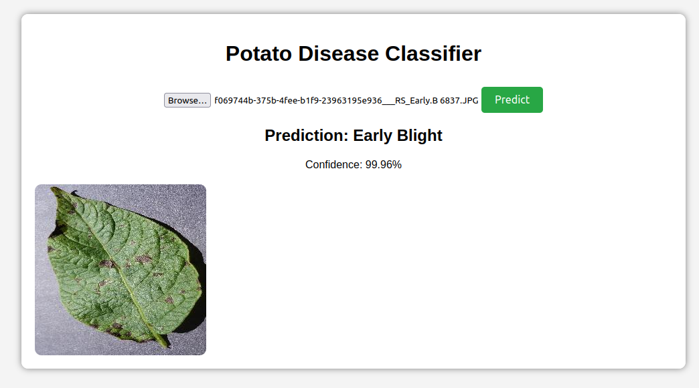
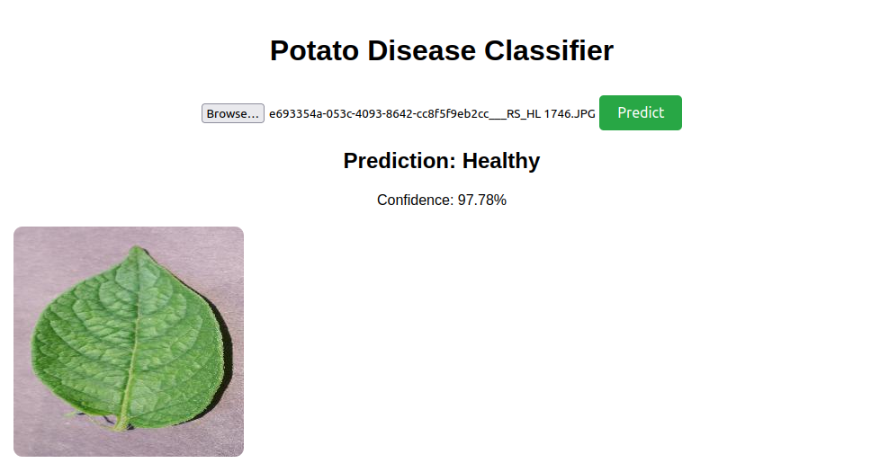

# Leaf Disease Classification

## Introduction
This project is focused on **training a deep learning model** to classify **potato leaf diseases** using **convolutional neural networks (CNNs)**. The model is trained to detect three classes: **Early blight fungus, late blight fungus, and Healthy leaves**. The dataset is preprocessed, augmented, and trained using TensorFlow. The trained model is then used for inference via a FastAPI backend.

## Model Training Process
### **1. Dataset & Preprocessing**
- **Dataset:** `PlantVillage` dataset containing **2152 images**.
- **Classes:**
  - `Potato___Early_blight`
  - `Potato___Late_blight`
  - `Potato___healthy`
- **Preprocessing Steps:**
  - Images are loaded using `image_dataset_from_directory()`.
  - Resized to **256x256** and converted to tensors.
  - Normalized (pixel values scaled between `0` and `1`).
  - Dataset split:
    - **80% Training**
    - **10% Validation**
    - **10% Testing**

### **2. Data Augmentation**
- Applied augmentation to improve generalization:
  - **Random Flipping** (horizontal and vertical).
  - **Random Rotation** (±20 degrees).
  - **Rescaling** using `tf.keras.layers.experimental.preprocessing`.

### **3. Model Architecture**
The model is a **Convolutional Neural Network (CNN)**:
- **6 Convolutional Layers** with `ReLU` activation.
- **MaxPooling Layers** to reduce spatial dimensions.
- **Fully Connected (Dense) Layers** with Softmax activation.
- **Categorical Crossentropy Loss** and `Adam` Optimizer.

### **4. Training & Evaluation**
- **Optimizer:** Adam
- **Loss Function:** Sparse Categorical Crossentropy
- **Epochs:** 50
- **Results:**
  - **Training Accuracy:** ~99%
  - **Validation Accuracy:** ~97-98%
  - **Final Test Accuracy:** **100%**

### **5. Visualizing Model Performance**
- Plotted **accuracy and loss curves** to track model training.
- Analyzed **confusion matrix** for classification performance.

## Future Improvements
- **Expand the model** to classify diseases in other leaf types.
- **Enhance visualizations** to better understand model decisions.
- **Optimize model for deployment** on edge devices or cloud.
- **Integrate a frontend** to provide a user-friendly interface.

## Here are the steps to run the application:
Navigate to the project root directory
cd /path/to/your/project

# Activate your virtual environment
source venv/bin/activate

# Install backend dependencies
pip install -r api/requirements.txt

# Run the FastAPI server
cd api
python main.py

Frontend Setup:
Since this is a static frontend, you'll want to serve it using a simple local server:
# From the project root
cd frontend
python -m http.server 5000  # Serves on port 5000

Important Notes:

Ensure your virtual environment is activated
Make sure all dependencies are installed
The backend expects the model to be at ../saved_models/3
The frontend makes API calls to http://localhost:8000/predict

## Learning Outcomes
- **Deep Learning for Image Classification:**
  - Improved model training strategies for **high-accuracy classification**.
- **Data Augmentation & Preprocessing:**
  - Utilized **TensorFlow/Keras layers** for enhanced model performance.
- **Performance Monitoring & Analysis:**
  - Tracked training metrics to detect overfitting and optimize training.

## License
This project is for educational purposes and follows best practices in **machine learning and model deployment**.

---
