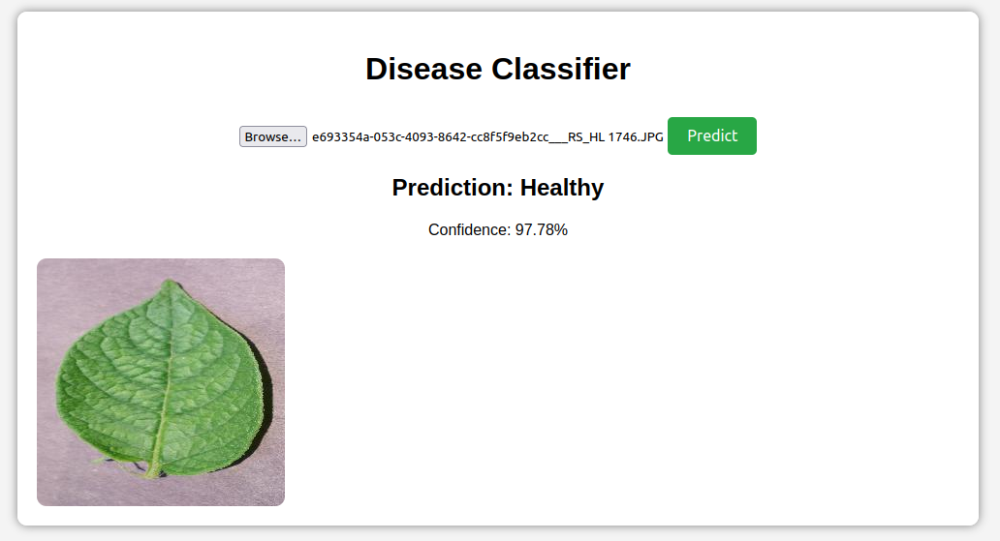
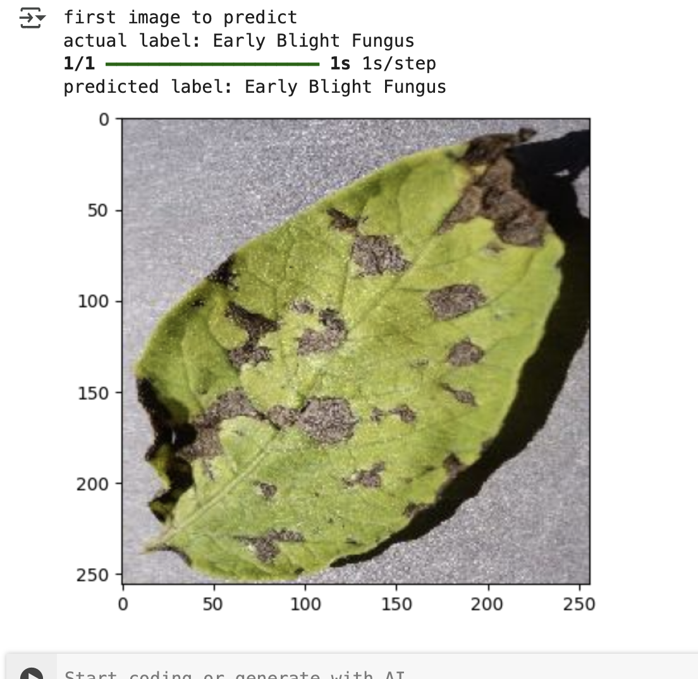
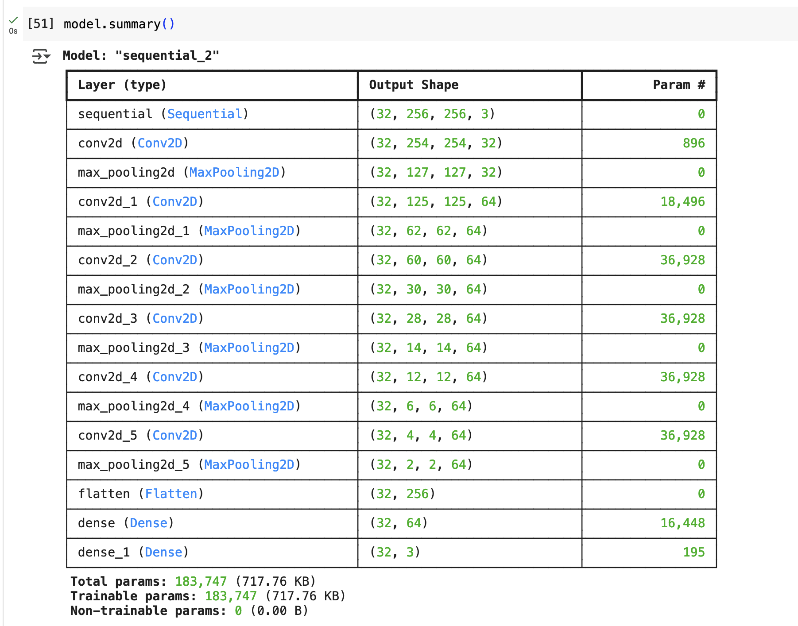

# Leaf Disease Classification







## Introduction
This project focuses on **training a deep learning model** to classify **vegetable leaf diseases** using **convolutional neural networks (CNNs)**. The model is trained to detect three classes: **Early Blight Fungus, Late Blight Fungus, and Healthy Leaves**. The dataset is **preprocessed, augmented, and trained** using TensorFlow. The trained model is deployed for inference via a **FastAPI backend**, with a frontend interface for user interaction.

## Model Training Process
### **1. Dataset & Preprocessing**
- **Dataset:** `PlantVillage` dataset containing **2152 images**.
- **Classes:**
  - **Early Blight Fungus**
  - **Late Blight Fungus**
  - **Healthy Leaves**
- **Preprocessing Steps:**
  - Images are loaded using `image_dataset_from_directory()`.
  - Resized to **256x256** and converted to tensors.
  - Normalized (pixel values scaled between `0` and `1`).
  - Dataset split:
    - **80% Training**
    - **10% Validation**
    - **10% Testing**

### **2. Data Augmentation**
To improve model generalization and reduce overfitting:
- **Random Flipping** (horizontal and vertical).
- **Random Rotation** (±20 degrees).
- **Rescaling** using `tf.keras.layers.experimental.preprocessing`.

### **3. Model Architecture**
The model is based on a **Convolutional Neural Network (CNN)**:
- **6 Convolutional Layers** with `ReLU` activation.
- **MaxPooling Layers** to reduce spatial dimensions.
- **Fully Connected (Dense) Layers** with Softmax activation.
- **Categorical Crossentropy Loss** and `Adam` Optimizer.

### **4. Training & Evaluation**
- **Optimizer:** Adam
- **Loss Function:** Sparse Categorical Crossentropy
- **Epochs:** 50
- **Results:**
  - **Training Accuracy:** ~99%
  - **Validation Accuracy:** ~97-98%
  - **Final Test Accuracy:** **100%**

### **5. Visualizing Model Performance**
- Plotted **accuracy and loss curves** to track model training.
- Analyzed **confusion matrix** to assess classification performance.

## Future Improvements
- **Expand the model** to classify diseases in other plant species.
- **Enhance visualizations** for better interpretability of model decisions.
- **Optimize the model for deployment** on edge devices or cloud services.
- **Develop a frontend interface** for seamless user interaction.

## Running the Application
### **1. Backend Setup**
Navigate to the project root directory and activate the virtual environment:
```sh
cd /path/to/your/project
source venv/bin/activate
```
Install dependencies and run the FastAPI backend:
```sh
pip install -r api/requirements.txt
cd api
python main.py
```

### **2. Frontend Setup**
Since this is a static frontend, serve it using a local server:
```sh
cd frontend
python -m http.server 5000  # Serves on port 5000
```

### **3. Important Notes**
- Ensure your **virtual environment** is activated.
- Make sure all **dependencies** are installed.
- The backend expects the trained **model to be located at** `../saved_models/3`.
- The frontend makes API calls to `http://localhost:8000/predict`.


